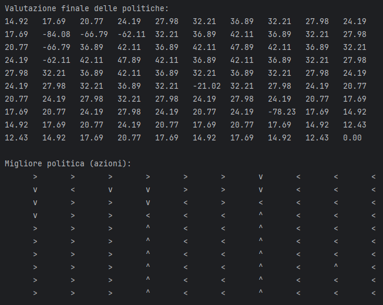

# Lab 06
# Task 1: VERIFIER
Code and do some analysis on the Readers & Writers Petri Net. Add a test to check that in no path long at most 100 states mutual
exclusion fails (no more than 1 writer, and no readers and writers together). Can you extract a small API for representing safety properties?
What other properties can be extracted? How the boundness assumption can help?

## Implementazione: 

Nell'implementazione, sono state utilizzate le seguenti classi e tecniche:
1. **[PNReadersWriters](src/main/scala/u06/examples/PNReadersWriters.scala)**: Questa classe rappresenta il Petri Net dei Readers & Writers, con transizioni modificate per garantire la mutual exclusion.
2. **[MutualExclusion](src/main/scala/u06/modelling/MutualExclusion.scala)**: Una classe che modella la proprietà di safety legata alla mutual exclusion, che assicura che non ci siano violazioni tra scrittori e lettori attivi contemporaneamente.
3. **[Boundedness](src/main/scala/u06/modelling/Boundedness.scala)**: Verifica che il numero di token in ogni posto del Petri Net non superi una soglia massima (in questo caso, 10 token).
4. **[SystemAnalysis](src/main/scala/u06/modelling/SystemAnalysis.scala)**: Fornisce funzioni per generare percorsi completi attraverso il Petri Net e filtrarli per garantire che rispettino certe proprietà.

Infine, il nuovo modello può essere testato tramite la classe: [PNReadersWritersSpec](src/test/scala/u06/modelling/Task1/PNReadersWritersSpec.scala).

Questa implementazione permette di verificare le proprietà di mutual exclusion e boundedness per il modello di Readers & Writers. La separazione delle proprietà di safety in classi specifiche come MutualExclusion e Boundedness consente una maggiore riusabilità e chiarezza nel codice. Ulteriori proprietà possono essere aggiunte facilmente seguendo questo approccio modulare.


# Task 2: DESIGNER
Code and do some analysis on a variation of the Readers & Writers Petri Net: it should be the minimal variation you can think of, such that
if a process says it wants to read, it eventually (surely) does so. How would you show evidence that your design is right? What about a
variation where at most two process can write?

## Implementazione: 

Si è definito un **Petri Net** minimale con transizioni che gestiscono le richieste di lettura e scrittura. I lettori devono attendere fino a quando non c'è un processo di scrittura in corso, mentre gli scrittori possono accedere al loro turno solo se non ci sono lettori attivi. Inoltre, si è limitato il numero di scrittori concorrenti a due.

- **[Liveness](src/main/scala/u06/modelling/Liveness.scala)**: Se un processo chiede di leggere, alla fine gli sarà garantita la lettura. Questo è stato implementato aggiungendo una transizione che garantisce che il lettore passi da uno stato di attesa (WaitToRead) allo stato di lettura (Reading).

- **[MutualExclusion](src/main/scala/u06/modelling/MutualExclusion.scala)**: Assicuriamo che lettori e scrittori non possano accedere simultaneamente alle risorse, creando transizioni che vietano la scrittura quando è in corso una lettura, e viceversa.

### Verifica delle Proprietà
Si è verificato il modello come visibile nella classe [PNReadersWritersSpecMinimal](src/test/scala/u06/modelling/Task2/PNReadersWritersMinimalSpec.scala) generando percorsi di esecuzione con una profondità massima di 100, e analizzato ogni percorso per identificare violazioni alle proprietà di safety:
- **Liveness**: Controlla che ogni processo in attesa di leggere eventualmente possa farlo.
- **Mutual Exclusion**: Controlla che non ci siano stati in cui la lettura e la scrittura avvengano simultaneamente.

Nessuna violazione è stata trovata, fornendo evidenza che il design soddisfa le proprietà richieste.

# Task 3: ARTIST
Create a variation/extension of PetriNet meta-model, with priorities: each transition is given a numerical priority, and no transition can
fire if one with higher priority can fire. Show an example that your pretty new “abstraction” works as expected. Another interesting extension
is “coloring”: tokens have a value attached, and this is read/updated by transitions.

## Implementazione:

Sono state introdotte due estensioni principali al meta-modello di PetriNet: **[PetriNetWithPriority](src/main/scala/u06/modelling/PetriNetWithPriority.scala)** e **[PetriNetWithColoring](src/main/scala/u06/modelling/PetriNetWithColoring.scala)** dei token.

### PetriNetWithPriority
In questa estensione, ogni transizione ha una priorità numerica. Quando più transizioni sono abilitate contemporaneamente, solo quella con priorità maggiore può essere eseguita. Questo permette di gestire scenari in cui determinati eventi devono avere precedenza su altri, garantendo che le regole più importanti vengano rispettate.

L'implementazione organizza le transizioni in ordine decrescente di priorità. Durante l'esecuzione, la rete analizza solo le transizioni più alte e ne esegue una se possibile. Un esempio classico potrebbe essere un processo con più task, dove quelli più critici devono essere eseguiti prima rispetto a quelli meno importanti.

### PetriNetWithColoring
In questo modello, i token presenti nei posti della rete hanno un "colore", che rappresenta un valore aggiunto (es. una caratteristica o un ruolo). I token colorati possono essere letti e aggiornati dalle transizioni. Questo approccio permette di gestire situazioni complesse in cui lo stato di un token non è determinato solo dalla sua presenza in un determinato posto, ma anche da ulteriori attributi.

Il cambiamento principale è stato effettuato su [ColoredMSet](src/main/scala/u06/utils/ColoredMSet.scala), che è stato esteso per rappresentare multiset di token colorati. Ora è possibile associare un valore (il "colore") a ciascun token, e le operazioni sulle reti Petri possono leggere o modificare questi valori.

Ad esempio, nella simulazione di un sistema Readers-Writers, ogni token potrebbe rappresentare un lettore o uno scrittore, e le transizioni leggerebbero e modificherebbero i valori associati a questi token per modellare correttamente il comportamento di lettura e scrittura.

### Esempi
- **[PetriNetWithPriorityExample](src/main/scala/u06/examples/PNWithPriorityExample.scala)**: Supponiamo di avere una rete con due transizioni, una con priorità più alta dell'altra. Quando entrambe sono abilitate, viene eseguita prima la transizione con priorità più alta, garantendo che le operazioni più urgenti abbiano sempre la precedenza.
- **[PetriNetWithColoringExample](src/main/scala/u06/examples/PNWithColoringExample.scala)**: Nel sistema Readers-Writers, i token "colorati" rappresentano i lettori e gli scrittori. Le transizioni aggiornano questi token in base alle regole del sistema, garantendo che più lettori possano leggere contemporaneamente ma che uno scrittore abbia accesso esclusivo.

Queste estensioni offrono maggiore flessibilità e precisione nel modellare sistemi complessi.


# Task 4: TOOLER
The current API might be re-organised: can we generate/navigate all paths thanks to caching and lazy evaluation? can we use
monads/effects to capture non-determinism? can we generate paths and capture safety properties by ScalaCheck?

## Implementazione:

Entrambe le feature richieste dal task sono state apportate estendendo la classe: [SystemAnalysis](src/main/scala/u06/modelling/SystemAnalysis.scala)

### Caching e Lazy Evaluation

Per ottimizzare l'esplorazione di percorsi, utilizziamo una combinazione di **lazy evaluation** e **caching**. Questo ci permette di generare i percorsi in modo "pigro" (ossia solo quando sono effettivamente necessari), evitando di ricalcolare percorsi già esplorati. In questo modo, otteniamo un significativo risparmio in termini di tempo e risorse computazionali, specialmente quando si gestiscono sistemi complessi come il problema dei Readers & Writers. La funzione `completePathsLazy` implementa questo approccio, dove i percorsi vengono memorizzati man mano che vengono esplorati, per essere poi riutilizzati.

### Cattura del Non-Determinismo

Il non determinismo è un aspetto critico nell'analisi di sistemi concorrenti, come nel caso del problema dei Readers & Writers. Viene catturato utilizzando strutture monadiche (come `Future`) che permettono di gestire la ramificazione dei percorsi esplorati. Questo ci consente di esplorare tutte le possibili evoluzioni del sistema e di verificarne la correttezza. La funzione `completePathsNonDeterministic` è un esempio di come catturiamo il non determinismo e esploriamo i percorsi in parallelo, mantenendo il controllo su tutte le possibili evoluzioni.

## Verifica delle Proprietà di Safety

Un aspetto fondamentale di questo task è la verifica delle **proprietà di safety** con la classe [PNReadersWritersNewTools](src/test/scala/u06/modelling/Task4/PNReadersWritersNewTools.scala), che nel nostro caso includono:
- **Mutual Exclusion** e **Boundness**.

### ScalaCheck per la Verifica

La classe [PNReadersWritersScalaCheck](src/test/scala/u06/modelling/Task4/PNReadersWritersScalaCheck.scala) è stata utilizzata per generare automaticamente percorsi e stati possibili, verificando le proprietà di safety su questi percorsi generati. Grazie ai generatori di ScalaCheck, possiamo esplorare in maniera efficace sia percorsi deterministici che non deterministici, valutando se violano o meno le proprietà di mutua esclusione e boundedness. Questo approccio automatizzato facilita l'identificazione di eventuali violazioni in un insieme di percorsi generati casualmente, permettendoci di scalare il testing in modo efficiente.

In sintesi, grazie a caching, lazy evaluation, monadi per il non determinismo e ScalaCheck per la generazione automatica di percorsi, riusciamo a catturare l'intero spazio degli stati e verificare le proprietà di safety del sistema.


# Task 5: PETRINET-LLM
We know that LLMs/ChatGPT can arguably help in write/improve/complete/implement/reverse-engineer standard ProgLangs. But is it of help in
designing Petri Nets? Does it truly “understand” the model? Does it understand our DSL by examples?

## Implementazione:


### 1. Scrivere (**write**)
Gli LLM sono in grado di scrivere codice che rappresenta modelli di Petri Net da zero, sulla base di descrizioni testuali.

#### Esempio: Scrivere un modello di base per una Petri Net
```scala
val pnRW = PetriNet(
  places = Set(Place.IdleReader, Place.IdleWriter, Place.Reading, Place.Writing),
  transitions = Set(
    Transition("startReading", Set(Place.IdleReader), Set(Place.Reading)),
    Transition("startWriting", Set(Place.IdleWriter), Set(Place.Writing)),
    Transition("finishReading", Set(Place.Reading), Set(Place.IdleReader)),
    Transition("finishWriting", Set(Place.Writing), Set(Place.IdleWriter))
  )
)
```
In questo esempio, l'LLM ha generato correttamente un modello semplice di Petri Net, dimostrando la sua capacità di scrivere codice strutturato.

### 2. Migliorare (**improve**)
Gli LLM possono anche migliorare un modello esistente, suggerendo ottimizzazioni o nuovi modi per organizzare il codice.

#### Esempio: Ottimizzare il controllo delle proprietà
Se il modello precedente viene ottimizzato per la verifica di proprietà di safety, l'LLM può proporre miglioramenti come l'uso della lazy evaluation per migliorare le prestazioni:

```scala
val pathsLazy = pnRW.completePathsLazy(initialState, 10)

pathsLazy.filter { path =>
  path.exists(state => mutualExclusion.isViolated(state) || boundedness.isViolated(state))
}
```

### 3. Completare (**complete**)

Quando un modello di Petri Net è parzialmente definito, gli LLM possono essere usati per completare le parti mancanti, come l'aggiunta di transizioni o la definizione di ulteriori posti.

#### Esempio: Completare una transizione mancante

```scala
// Transizioni parziali
val pnRW = PetriNet(
  places = Set(Place.IdleReader, Place.IdleWriter),
  transitions = Set(
    Transition("startReading", Set(Place.IdleReader), Set(Place.Reading)),
    // Mancano altre transizioni
  )
)

// Completamento della transizione mancante
val finishReading = Transition("finishReading", Set(Place.Reading), Set(Place.IdleReader))
```

### 4. Implementare (**implement**)
Un LLM può implementare funzioni o metodi all'interno di un modello di Petri Net, ad esempio, per calcolare percorsi completi o analizzare proprietà.

#### Esempio: Implementare una funzione per trovare percorsi completi
```scala
def completePaths(s: S, depth: Int): Seq[Path[S]] =
  (1 to depth).flatMap(paths(s, _)).filter(complete)
```
Qui l'LLM ha implementato una funzione per trovare percorsi completi in una Petri Net, dimostrando la capacità di tradurre una richiesta in codice funzionante.

### 5. Reverse Engineering (**reverse-engineer**)

L'LLM può anche essere utilizzato per fare reverse engineering di un modello di Petri Net esistente. Partendo da un output (ad esempio, un comportamento o una traccia), può cercare di dedurre la struttura della rete.

#### Esempio: Dedurre una transizione da uno stato finale

```scala
// Stato finale osservato: Place.IdleReader, Place.Reading
// Deduciamo la transizione che potrebbe aver portato a questo stato
val inferredTransition = Transition("startReading", Set(Place.IdleReader), Set(Place.Reading))
```
In questo esempio, partendo da un'osservazione dello stato finale, l'LLM è in grado di inferire una possibile transizione che potrebbe aver portato a tale stato.

### Conclusione
Chiaramente tutto ciò dimostra il loro corretto funzionamento in questo specifico contesto di modelling. Tuttavia, la loro efficacia dipende sempre dalla chiarezza degli input e dal livello di complessità richiesto.

# Lab 07

# Task 1: SIMULATOR
Take the communication channel CTMC example in StochasticChannelSimulation. Compute the average time at which
communication is done—across n runs. Compute the relative amount of time (0% to 100%) that the system is in fail state until
communication is done—across n runs. Extract an API for nicely performing similar checks.

## Implementazione:

**Sorgenti**:

* [CTCMAnalysis](src/main/scala/u07/modelling/CTCMAnalysis.scala)
* [StochasticChannelSimulation](src/main/scala/u07/examples/StochasticChannelSimulation.scala)

Per risolvere il task relativo alla simulazione del Continuous-Time Markov Chain (CTMC) per un canale di comunicazione, ho sviluppato una serie di funzioni che mi permettono di eseguire simulazioni ripetute e calcolare sia il tempo medio di completamento della comunicazione, sia la percentuale di tempo trascorsa nello stato di errore (FAIL) fino al completamento della comunicazione.

Ho iniziato creando una funzione generica `simulate` che accetta il CTMC, lo stato iniziale e il numero di esecuzioni (runs). Questa funzione genera delle tracce di simulazione che terminano quando viene raggiunta una condizione specificata (stop condition). Questo mi permette di riutilizzare la funzione in contesti diversi, mantenendo un'API flessibile.

La funzione `averageTimeToState` calcola il tempo medio necessario per raggiungere uno stato target, ad esempio lo stato finale `DONE`, attraverso più esecuzioni. Per ciascuna simulazione, la funzione somma i tempi necessari per raggiungere lo stato target e ne calcola la media.

Per quanto riguarda il secondo obiettivo del task, ho implementato `failTimePercentage`, una funzione che calcola la percentuale del tempo trascorsa nello stato di errore `FAIL`. Durante la simulazione, tengo traccia del tempo totale e del tempo trascorso nello stato di errore, poi utilizzo questi valori per determinare la percentuale di tempo in cui il sistema si trova nello stato di errore rispetto al tempo totale fino al completamento della comunicazione.

Infine, ho verificato i risultati implementando un'analisi eseguita tramite la funzione `runAnalysis`, che esegue 1000 simulazioni per ciascun calcolo (tempo medio e percentuale di tempo in errore). Questi risultati vengono stampati, consentendo una valutazione immediata dell'efficienza del sistema e del comportamento in caso di errori.

Le funzioni create possono essere riutilizzate facilmente per eseguire altre analisi su modelli CTMC simili, grazie all'astrazione fornita dalla funzione `simulate`, che gestisce in maniera modulare la simulazione e l'analisi degli stati.

# Task 2: GURU
Check the SPN module, that incorporates the ability of CTMC modelling on top of Petri Nets, leading to Stochastic Petri Nets. Code
and simulate Stochastic Readers & Writers shown in previous lesson. Try to study how key parameters/rate influence average time the
system is in read or write state.

## Implementazione:

**Sorgenti**:

* [StochasticReadersWriters](src/main/scala/u07/examples/StochasticReadersWriters.scala)


Per affrontare il task di modellazione stocastica dei Readers & Writers utilizzando le Stochastic Petri Nets (SPN), ho implementato un modulo che combina i concetti di Petri Net con quelli del Continuous-Time Markov Chain (CTMC), in modo da simulare i comportamenti dei lettori e degli scrittori in un sistema concorrente. L'obiettivo è stato quello di studiare l'influenza dei parametri chiave sui tempi medi di permanenza del sistema negli stati di lettura e scrittura.

Ho definito i vari stati possibili per i lettori e gli scrittori utilizzando un'enumerazione (`Place`), che include stati di lettura (`READING`), scrittura (`WRITING`), e stati di attesa o inattività come `WAITING_READER`, `WAITING_WRITER`, `IDLE_READER`, e `IDLE_WRITER`.

Per rappresentare la logica di transizione tra questi stati, ho modellato le regole seguenti:
- Un lettore può iniziare a leggere solo se non ci sono scrittori attualmente in fase di scrittura.
- Al termine della lettura, il lettore entra in uno stato di inattività (`IDLE_READER`), prima di poter tornare nello stato di attesa di lettura.
- In modo simile, uno scrittore può iniziare a scrivere solo se non ci sono altri scrittori o lettori che stanno leggendo.
- Al termine della scrittura, lo scrittore passa allo stato di inattività (`IDLE_WRITER`), per poi tornare nello stato di attesa di scrittura.

Per ciascuna di queste transizioni ho associato una funzione che definisce il tasso stocastico con cui avviene il cambiamento di stato, il che rende il sistema una Stochastic Petri Net (SPN). Ho quindi creato il modello SPN dei Readers & Writers con queste transizioni e ho definito un marking iniziale, che rappresenta lo stato iniziale del sistema (con lettori e scrittori entrambi in attesa di accedere alla risorsa).

Successivamente, ho convertito il modello SPN in un CTMC utilizzando la funzione `toCTMC`, così da poter eseguire simulazioni stocastiche del sistema. Queste simulazioni permettono di osservare i comportamenti temporali e stocastici del sistema, tracciando il passaggio da uno stato all'altro. Infine, ho generato delle trace della simulazione, che mostrano una sequenza di eventi casuali che si verificano nel tempo.

# Task 4: RANDOM-UNIT-TESTER
How do we unit-test with randomness? And how we test at all with randomness? Think about this in general. Try to create a
repeatable unit test for Statistics as in utils.StochasticSpec.

## Implementazione:

**Sorgenti**:

* [StochasticSpec](src/test/scala/u07/modelling/StochasticSpec.scala)

Nel contesto di questo task, mi è stato chiesto di risolvere una problematica complessa legata al testing di funzioni che contengono casualità, affrontando la domanda: "Come possiamo effettuare unit test con randomness?". Il problema centrale è legato alla ripetibilità dei test che utilizzano variabili casuali, che per loro natura possono produrre risultati diversi ad ogni esecuzione. Per garantire la coerenza e la ripetibilità dei test, è stato necessario fissare un seed per il generatore di numeri casuali, così che la sequenza di numeri generati fosse sempre la stessa in ogni esecuzione del test.

Ho affrontato questa problematica utilizzando la libreria **ScalaCheck**, che consente di generare test basati su proprietà. In particolare, mi sono concentrato sul test della funzione `Stochastics.statistics`, che genera distribuzioni di frequenza in base alle probabilità assegnate a ciascun elemento in input. Questo ha richiesto la creazione di un set di scelte con probabilità note e l'esecuzione di simulazioni su una quantità fissa di iterazioni (1000 campioni in questo caso).

Il cuore del test risiede nella verifica che le proporzioni degli elementi selezionati siano in linea con le probabilità attese, tenendo conto di una piccola tolleranza dovuta alla natura casuale del processo. Nello specifico:
- Ho verificato che la probabilità dell'elemento "a" sia vicina al 50% (tolleranza tra il 45% e il 55%).
- La probabilità dell'elemento "b" sia vicina al 30% (tolleranza tra il 25% e il 35%).
- La probabilità dell'elemento "c" sia vicina al 20% (tolleranza tra il 15% e il 25%).

Questa implementazione garantisce che il test sia ripetibile, deterministico e consenta di verificare accuratamente il comportamento della funzione anche in presenza di randomness.

# Task 5: PROBABILITY-LLM
We know that LLMs/ChatGPT can arguably help in write/improve/complete/implement/reverse-engineer standard ProgLangs. But is
it of help in taking into account probability? Seemingly, it shorty fails. But with the proper prompt, it might say something reasanble.

## Implementazione:

Di seguito si analizzano i vari aspetti richiesti dal task:

* **Write:**
  Un LLM è estremamente efficace nello scrivere codice da zero in linguaggi di programmazione standard. Per esempio, nel caso di una funzione che genera numeri casuali basati su una distribuzione probabilistica:
    
    ```scala
    def generateRandomNumber(probabilities: List[Double]): Int = 
    val cumulative = probabilities.scanLeft(0.0)(_ + _).tail
    val randomVal = scala.util.Random.nextDouble()
    cumulative.indexWhere(randomVal <= _)
    ```
* **Improve:**
  Gli LLMs possono anche migliorare codice esistente. Per esempio, ottimizzando la funzione sopra per evitare calcoli ridondanti o per gestire edge cases (come liste vuote):
    ```scala
  def generateRandomNumber(probabilities: List[Double]): Option[Int] = 
  if (probabilities.isEmpty) None
  else {
    val cumulative = probabilities.scanLeft(0.0)(_ + _).tail
    val randomVal = scala.util.Random.nextDouble()
    Some(cumulative.indexWhere(randomVal <= _))
  }
    ```
    Qui, il miglioramento risiede nella gestione di un input vuoto restituendo None anziché causare un errore
    

* **Complete:**
  Gli LLMs possono completare parti mancanti di codice fornendo strutture logiche coerenti. Ad esempio, se avessi già una parte della funzione che gestisce le probabilità ma manca la logica di aggregazione, l'LLM può completare il processo:
    ```scala
  def cumulativeProbabilities(probabilities: List[Double]): List[Double] = 
  probabilities.scanLeft(0.0)(_ + _).tail
  ```
  Questo è un tipico esempio di completamento, dove l'LLM può dedurre come procedere in modo naturale.


* **Implement:**
  In un caso in cui il design di una funzione è già stato definito, l'LLM può facilmente implementare la logica. Per esempio, implementare una funzione per generare una statistica basata su un insieme di probabilità:
    ```scala
  def generateStatistics(choices: Set[(Double, String)], trials: Int): Map[String, Int] = 
  val cumulativeChoices = choices.toList
  (1 to trials).map { _ =>
    val randomChoice = Stochastics.draw(cumulativeChoices)
    randomChoice
  }.groupBy(identity).mapValues(_.size)
  ```
  Qui l'LLM implementa una funzione per condurre vari test basati su probabilità specifiche.


* **Reverse-Engineer:**
  Anche se limitato, l'LLM può essere di supporto nel reverse-engineering di codice esistente, analizzando la funzione per dedurre il comportamento sottostante, però non arriva a dedurre sistemi di probabilità. Per esempio:
    ```scala
     // Codice dato:
    def mysteryFunction(input: List[Double]): Double = 
    input.sum / input.length
    ```
    ```txt
    // Analisi:
    Questa funzione calcola la media di una lista di numeri.
    ```
  L'LLM identifica rapidamente che la funzione restituisce la media dei valori nella lista fornita.

# LAB 09 

# Task : Basic-Q-Learning

## Implementazione: 

* **Epsilon** controlla quanto esploriamo rispetto a quanto sfruttiamo le conoscenze attuali. Un epsilon più alto (es. 0.9) comporta maggiore esplorazione, mentre un epsilon basso (es. 0.1) comporta più sfruttamento delle scelte migliori trovate finora.
  Sono stati eseguiti 3 test in cui epsilon assumeva valore rispettivamente: 0.1 , 0.5, 0.9 e in tutti i tentativi riportati la tabella iniziale assumeva sempre la stessa forma.
  <p align="center">
  
  
  
  </p>

* **Gamma** determina quanto valore attribuiamo alle ricompense future rispetto a quelle immediate. Gamma più alto (es. 0.9) darà più importanza ai reward futuri, mentre un gamma basso (es. 0.1) privilegia le ricompense immediate.
  <p align="center">
  
  </p>
* **Alpha** è il fattore di apprendimento. Valori più alti (es. 0.9) portano a un apprendimento più rapido, ma possono essere rumorosi, mentre un valore più basso (es. 0.1) porta a un apprendimento più lento ma più stabile.
  <p align="center">
  
  </p>

* Aumentare il **numero di step massimi** per ogni episodio può avere un impatto significativo sull’apprendimento, soprattutto in ambienti più complessi. Per questo ho incrementato il numero di episodi a 200 per ottenere il seguente risultato:
  <p align="center">
  
  </p>

* Aumentando la **dimensione della griglia** (es. da 5x5 a rispettivamente 10x10 o 20x20), puoi osservare come diventa più difficile l'apprendimento a causa dell'aumento del numero di stati possibili.
  <p align="center">
  
  
  </p>

## Conclusione

### **Risultati con Parametri di Default**

- I **valori Q** sembrano distribuiti in modo uniforme sulla griglia.
- La **politica di direzione** (`>`, `<`, `^`, `V`) riflette una politica coerente, con una chiara tendenza di movimento basata sui valori Q più alti in ogni stato.

**Interpretazione**:  
Con valori ben bilanciati di α (tasso di apprendimento), γ (fattore di sconto) ed epsilon (esplorazione sfruttamento), l'agente impara a navigare in modo ottimale nell'ambiente, risultando in valori Q stabili e in una politica coerente.

---

### **Risultati con Gamma Basso**

- I **valori Q** risultano notevolmente ridotti, specialmente negli stati più lontani dai punti di ricompensa (i numeri decrescono rapidamente allontanandosi).
- La **politica di direzione** rimane simile, ma con valori Q che degradano rapidamente.

**Interpretazione**:  
Un valore basso di γ implica che l'agente è maggiormente focalizzato sulle ricompense immediate piuttosto che su quelle future. Questo porta a valori Q più bassi nelle aree lontane dal premio, indicando che l'agente preferisce movimenti immediati verso le ricompense vicine.

---

### **Risultati con Alpha Basso**

- I **valori Q** sono quasi invariati rispetto al caso default, ma la convergenza è più lenta.
- La **politica di direzione** rimane la stessa, il che significa che la direzione migliore è stata ancora trovata, ma i valori Q si sono aggiornati più lentamente.

**Interpretazione**:  
Un valore basso di α riduce la velocità di apprendimento dell'agente. Sebbene alla fine l'agente possa convergere verso una politica ottimale, l'apprendimento risulta più lento e i valori Q cambiano più gradualmente.

---

### **Risultati con aumento del numero di step**

- I **valori Q** sono quasi invariati rispetto al caso default, ma l'output tende ad essere comunque alterato.
- La **politica di direzione** è alterata dalla profondità che il learning ha avuto conseguentemente al numero di step.

**Interpretazione**:  
Un valore più alto del numero di step rende più accurato il learning che tenderà ad aumentare l'accuratezza dei suoi risultati.

---

---

### **Risultati con griglie aumentate**

- I **valori Q** sono aumentati rispetto gli esempi precedenti poiché ad aumentare è il numero di stati rendendo il problema molto più complesso.

**Interpretazione**:  
Un aumento della dimensione della griglia comporta al modello una più chiara interpretazione del sistema, non a caso in entrambi gli esempi superato un certo numero di stati i valori Q tendono tutti ad assumere 1.0, questo permette di concentrarsi su una zona esclusiva.

---

# Task: DESIGN-BY-Q-LEARNING
changing enviroment, state, rewards (and adding jumps, holes, items, enemies, walls, moving obstacles)
you can really make your “robot” learn virtually anything, e.g.:
* I define an environment as a sort of corridor with obstacles: your robot has to “zigzag walk” to avoid them
* I “program by learning” a robot to collect items one at a time and go back to inital position
* I “program by learning” a robot to move obstacles so as to hide from enemies


## Implementazione:

Il task richiedeva di progettare un robot usando il Q-learning per compiere diverse azioni, in un ambiente con ostacoli, nemici, oggetti, salti, muri e buchi. Di seguito alcune considerazioni:

1. **Ambiente**: L'ambiente è stato creato con una griglia di dimensione 10x10. L'agente parte dalla posizione (0,0) e deve raggiungere la posizione finale (9,9).


2. **Cambiato gli stati e i rewards**:

  - Ricompense sono state assegnate in base alla posizione e all'azione eseguita.
  - Ricompensa positiva (+100) per raggiungere la destinazione finale.
  - Penalità (-100) per cadere in buchi o incontrare ostacoli e nemici.
  - Penalità standard (-1) per ogni passo non ottimale.
  - Oggetti da raccogliere con piccole ricompense (+10).

3. **Salti, Buchi e Nemici**:
  - I "jumps" sono stati implementati in posizioni specifiche, permettendo al robot di saltare da un punto all'altro.
  - I "holes" (buchi) sono posizionati strategicamente nella griglia e rappresentano zone pericolose.
  - Sebbene non siano implementati ostacoli in movimento dinamico nel codice corrente, esistono ostacoli statici con penalità.

4. **Comportamento del Robot**:
  - **Zigzag Walk**: Il robot è incentivato a evitare gli ostacoli grazie alla penalità impostata, con un comportamento simile a un movimento a zigzag per trovare il percorso ottimale.
  - **Item Collection**: Il robot raccoglie oggetti (+10) posti in posizioni specifiche sulla griglia.
  - **Obstacle Evasion**: Con l'apprendimento, il robot impara a evitare ostacoli e buchi per evitare penalità.

## Risultati Attesi

- Il robot esplorerà la griglia, evitando gli ostacoli, raccogliendo oggetti e cercando di raggiungere la posizione finale (9,9).
- I valori finali delle politiche mostreranno la valutazione di ogni stato, con il robot che apprende a evitare penalità e a massimizzare le ricompense.

Il codice finale è visibile nel file [DeisgnByQLearning](src/main/scala/u09/examples/DesignByQLearning.scala)  e di seguito viene riportato uno screen dell'esecuzione che riporta ciò che che è stato detto in precedenza.

<p align="center">

</p>


